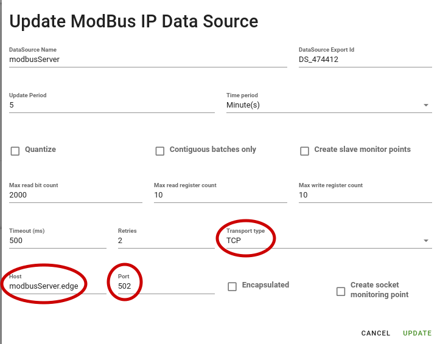
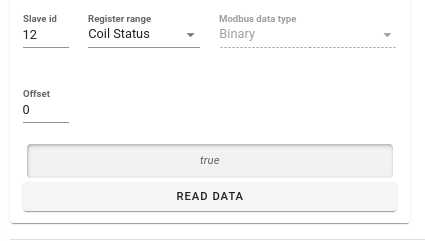

# Demo Services OpenZiti and Docker Container Setup

The services hosted by this docker setup fall into the category of non-ziti client applications that access OpenZiti server applications.
The Taste-of-Ziti modbusServer demo is an example of a OpenZiti native server application that binds to an OpenZiti service and can only be accessed
via an OpenZiti request on that service.

# Pre-Setup
## Create Basics - Controller and Router
1. Create an OpenZiti controller.  Use any of the [OpenZiti Quickstarts](https://openziti.io/docs/learn/quickstarts/network/hosted) or a CloudZiti Network.
1. Create an edge router or update an existing edge router so that it has the roleAttributes of `DemoServiceRouters` and `DemoClientRouters`

# Modbus Services
## ScadaER
    ziti edge create edge-router scadaER --tunneler-enabled --role-attributes 'ScadaERs' -o scadaER.jwt
Update the .env file for the scada docker image and set the `ZITI_CTRL_ADDRESS` and `ZITI_ENROLL_TOKEN` appropriately for your network and edge-router

## ScadaLTS Service
    ziti edge create config scadalts.hostv1 host.v1 '{"forwardProtocol": true, "allowedProtocols":["tcp","udp"], "address":"127.0.0.1", "port":8080}'
    ziti edge create config scadalts.clientv1 intercept.v1 '{"protocols":["tcp","udp"], "addresses":["scadalts.ziti"],"portRanges":[{"low":8080,"high":8080}]}'
    ziti edge create service scadalts -a 'ModbusService' --configs "scadalts.hostv1,scadalts.clientv1"
    ziti edge create service-edge-router-policy scadalts.serp --edge-router-roles '#all' --service-roles '@scadalts'
    ziti edge create service-policy scadalts.bind Bind --service-roles "@scadalts" --identity-roles "@scadaER"
    
    ziti edge create service-policy 'Modbus' Dial --service-roles "#ModbusService" --identity-roles "#ModbusPeripheral,#ScadaERs,@scadaER"
    
    ziti edge create edge-router-policy "Modbus Service Edge Router Policy" --semantic AnyOf --edge-router-roles '#DemoServiceRouters' --identity-roles '#ModbusPeripheral'


# Setup Modbus Taste-of-Ziti Demo Server

## Create an identity for the demo modbus server
    ziti edge create identity device modbusServer -a "ModbusPeripheral" -o taste_of_ziti.jwt
    ziti edge enroll -j taste_of_ziti.jwt


## Create a service for this demo server
    ziti edge create config modbusServer-modbus.clientv1 ziti-tunneler-client.v1 '{"hostname":"modbusServer.edge","port":502}'
    ziti edge create service modbusServer-modbus -a 'ModbusService' --configs "modbusServer-modbus.clientv1"
    ziti edge create service-edge-router-policy modbusServer-modbus.serp --edge-router-roles '#all' --service-roles '@modbusServer-modbus'
    ziti edge create service-policy modbusServer-modbus.bind Bind --service-roles "@modbusServer-modbus" --identity-roles "@modbusServer"

Start the demo client using the taste_of_ziti.json file created above.  For example, in the golang/modbusServer directory:

    go run . -i taste_of_ziti.json

The modbusServer demo is now listening for incoming connections on the OpenZiti network at the server address defined above as `modbusServer.edge:502`.

## Start and configure the ScadaLTS Docker Client Applications

Running from the scada docker directory:

        docker compose up -d

Log into the scadaLTS application at the address `http://localhost:8090/ScadaLTS`.  By default, the ScadaLTS application uses `admin/admin` for
login credentials.

Create a data source for the modbusServer
* Type: Modbus IP Data Source
* Transport Type: TCP
* Host: modbusServer.edge
* Port: 502



With the demo client running, queries from the scadaLTS application to that data source should appear in the demo client log

```
$ go run .  -i taste_of_ziti.json
2024/04/08 10:12:54 Loading identity from taste_of_ziti.json
2024/04/08 10:12:55 listening to Ziti service: modbusServer-modbus
INFO[0000] new service session                           session token=0ff51a20-9b11-4d1c-8dfc-e0aa6671b75c
2024/04/08 10:12:58 Received a ReadCoilsRequestTCP request for id=12
```

