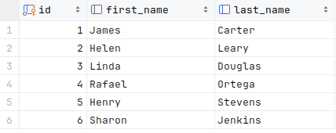

# OpenZiti DbClient

This example is a simple golang client that connects to a Postgres database using OpenZiti. 

The demo environment provides a sample Postgres database accessible by a service named `PostgresDemo`.  This
service provides access to a simple database named `sampledb` that has several tables from the petclinic server including a `vets` table with the following schema:



## Setup :wrench:
This example uses the Taste-of-Ziti demo network and its aperitivo service to obtain a temporary identity. Refer to
the [Taste-of-Ziti README](../../README.md) for additional details on the Taste-of-Ziti demo network.

## Requirements
* go 1.21.x or later
* gcc compiler

## Usage

By default, the dbClient connects to a hosted OpenZiti network and receives a temporary identity.  The 
identity is saved and reused for subsequent calls.  An alternate identity file can be used by calling the client with
the `-i <identityFile>` parameter.

### Example Output
```shell
$ go run dbClient -h
  -a string
    	optional Aperitivo url for acquiring an identity (default "https://aperitivo.production.netfoundry.io")
  -h	Display usage
  -i string
    	optional identity file

$ go run dbClient 
2024/01/17 15:34:04 Connecting to Aperitivo at https://aperitivo.production.netfoundry.io to generate a new temporary Identity
INFO[0001] generating 4096 bit RSA key                  
2024/01/17 15:34:06 A new Identity was enrolled and stored in /home/myDemoUser/taste-of-ziti/golang/dbClient/taste_of_ziti.json. This is a temporary Identity that is valid until Thu, 18 Jan 2024 20:34:04 UTC
2024/01/17 15:34:06 Loading identity from taste_of_ziti.json
2024/01/17 15:34:06 This identity provides access to the service: PostgresDemo
2024/01/17 15:34:06 Connecting to: postgresql://PostgresDemo/simpledb
2024/01/17 15:34:06 Database connected. Issuing a simple database query...
2024/01/17 15:34:07 Result from database is: 1: James Carter
2024/01/17 15:34:07 Result from database is: 2: Helen Leary
2024/01/17 15:34:07 Result from database is: 3: Linda Douglas
2024/01/17 15:34:07 Result from database is: 4: Rafael Ortega
2024/01/17 15:34:07 Result from database is: 5: Henry Stevens
2024/01/17 15:34:07 Result from database is: 6: Sharon Jenkins
```
