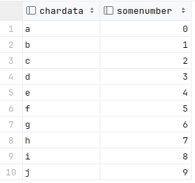

# OpenZiti JdbcGo

This example is a simple golang client that connects to a Postgres database using OpenZiti. 

The demo environment provides a sample Postgres database accessible by a service named `PostgresDemo`.  This
service provides access to a simple database named `sampledb` that has several tables from the petclinic server including a `vets` table with the following schema:



## Setup :wrench:
This example uses the Taste-of-Ziti demo network and its aperitivo service to obtain a temporary identity. Refer to
the [Taste-of-Ziti README](../../README.md) for additional details on the Taste-of-Ziti demo network.

## Requirements
* go 1.19 or later
* gcc compiler

## Build
Execute the following to build and place the executable in a directory labeled `build`

1. Run the following to create the build directory and build the project

       mkdir build
       go mod tidy
       go build -o build ./...

## Usage

By default, the jdbcGo client connects to a hosted OpenZiti network and receives a temporary identity.  The 
identity is saved and reused for subsequent calls.  An alternate identity file can be used by calling the client with
the `-i <identityFile>` parameter or from the `ZITI_IDENTITIES` environment variable.

### Example Output
```shell
$ ./jdbcGo -h
  -a string
    	optional aperitivo url for acquiring an identity (default "https://aperitivo.production.netfoundry.io")
  -h	Display usage
  -i string
    	optional identity file

$ ./jdbcGo 
INFO    Connecting to aperitivo at https://aperitivo.netfoundry.io to generate a new temporary identity 
INFO    generating 4096 bit RSA key                  
INFO    A new identity is being enrolled and stored in taste_of_ziti.json. This is a temporary identity that is valid until Thu, 14 Dec 2023 14:04:24 UTC 
INFO    Identity write completed                     
INFO    Loading identity from taste_of_ziti.json     
INFO    This identity provides access to the service: PostgresDemo 
INFO    Dialing PostgresDemo with a simple database query 
INFO    Result from database is: 1: James Carter     
INFO    Result from database is: 2: Helen Leary      
INFO    Result from database is: 3: Linda Douglas    
INFO    Result from database is: 4: Rafael Ortega    
INFO    Result from database is: 5: Henry Stevens    
INFO    Result from database is: 6: Sharon Jenkins   
```
