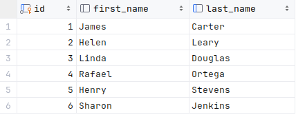

# OpenZiti DbClient

This example is a simple Java client that connects to a dark database using OpenZiti

The demo environment provides a sample Postgres database accessible by a service named `PostgresDemo`.  This
service provides access to a simple database named `sampledb` that has several tables from the petclinic server including a `vets` table with the following schema:



## Setup :wrench:
This example uses the Taste-of-Ziti demo network and its aperitivo service to obtain a temporary identity. Refer to
the [Taste-of-Ziti README](../../README.md) for additional details on the Taste-of-Ziti demo network.

## Requirements
* JDK 21 or later
* maven or gradle to build

## Build
Execute either of the following to build with the desired build framework

1. Run the following to build using maven

       ./mvnw clean install

1. Run the following to build using gradle

       ./gradlew clean build

## Usage

By default, the DbClient connects to a hosted OpenZiti network and receives a temporary identity.  The
identity is saved and reused for subsequent calls.  An alternate identity file can be used by calling the client with
the `-i <identityFile>` parameter.


### Example Output
```shell
$ ./gradlew run --args="-h"
> Task :runWithJavaExec
usage: DbClient
-a,--aperitivoUrl <arg>   URL for the aperitivo service. Defaults to 'https://aperitivo.production.netfoundry.io'
-h,--help                 Show this help text
-i,--identityFile <arg>   Identity file, json or pkcs12. Defaults to 'taste_of_ziti.pkcs12'
```

```shell
$  ./mvnw exec:java
[com.example.jdbcservice.DbClient.main()] INFO com.example.demoutils.AperitivoUtils - Connecting to aperitivo at https://aperitivo.production.netfoundry.io to generate a new identity
[com.example.jdbcservice.DbClient.main()] INFO com.example.demoutils.AperitivoUtils - Building a keystore to contain the new identity
[com.example.jdbcservice.DbClient.main()] INFO com.example.demoutils.AperitivoUtils - A new identity is stored at taste_of_ziti.pkcs12. This is a temporary identity that is valid until 12/08/2023 15:20:38
[com.example.jdbcservice.DbClient.main()] INFO com.example.jdbcservice.DbClient - Attempting to connect to ziti using identity stored in taste_of_ziti.pkcs12
[com.example.jdbcservice.DbClient.main()] INFO com.example.jdbcservice.DbClient - Connecting to: zdbc:postgresql://postgres.ziti/simpledb
[com.example.jdbcservice.DbClient.main()] INFO org.openziti.impl.ZitiImpl - ZitiSDK version 0.25.1 @344b49b()
[DefaultDispatcher-worker-3] INFO org.openziti.api.Controller - controller[https://4c17a450-52c0-4c6b-b3db-5a0477a7e5f7.production.netfoundry.io/] version(v0.31.0/5237e2b4794a)
[DefaultDispatcher-worker-2] INFO org.openziti.net.dns.ZitiDNSManager - assigned petstore.ziti => petstore.ziti/100.64.1.2 []
[DefaultDispatcher-worker-2] INFO org.openziti.net.dns.ZitiDNSManager - registered: petstore.ziti => petstore.ziti/100.64.1.2
[DefaultDispatcher-worker-2] INFO org.openziti.net.dns.ZitiDNSManager - assigned fireworks.ziti => fireworks.ziti/100.64.1.3 []
[DefaultDispatcher-worker-2] INFO org.openziti.net.dns.ZitiDNSManager - registered: fireworks.ziti => fireworks.ziti/100.64.1.3
[DefaultDispatcher-worker-2] INFO org.openziti.net.dns.ZitiDNSManager - assigned whatismyip.ziti => whatismyip.ziti/100.64.1.4 []
[DefaultDispatcher-worker-2] INFO org.openziti.net.dns.ZitiDNSManager - registered: whatismyip.ziti => whatismyip.ziti/100.64.1.4
[DefaultDispatcher-worker-2] INFO org.openziti.net.dns.ZitiDNSManager - assigned postgres.ziti => postgres.ziti/100.64.1.5 []
[DefaultDispatcher-worker-2] INFO org.openziti.net.dns.ZitiDNSManager - registered: postgres.ziti => postgres.ziti/100.64.1.5
[com.example.jdbcservice.DbClient.main()] INFO com.example.jdbcservice.DbClient - Database connected. Issuing a simple database query...
Result from database is: 1: James Carter
Result from database is: 2: Helen Leary
Result from database is: 3: Linda Douglas
Result from database is: 4: Rafael Ortega
Result from database is: 5: Henry Stevens
Result from database is: 6: Sharon Jenkins

```
